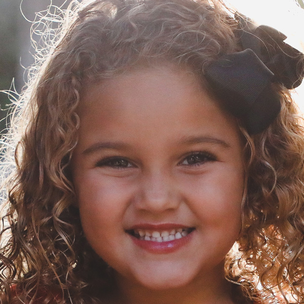

Preprocessing and loading ⚗️
--------------------------

In this notebook we will define the custom dataset, the data locator that will use the ViT Model trainer to load the data and the main preprocessing to make. Notice that the calculation of the loss is inputted in this notebook.

We will need some libraries.


```python
from torch.utils.data import DataLoader
from PIL import Image, ImageDraw
import matplotlib.pyplot as plt
from glob import glob
from math import *
import numpy as np
import itertools
import random
import pickle


# set style of the plots
plt.style.use("ggplot")
```

    c:\Users\Oumar Kane\AppData\Local\pypoetry\Cache\virtualenvs\pytorch1-HleOW5am-py3.10\lib\site-packages\tqdm\auto.py:22: TqdmWarning: IProgress not found. Please update jupyter and ipywidgets. See https://ipywidgets.readthedocs.io/en/stable/user_install.html
      from .autonotebook import tqdm as notebook_tqdm
    

### Preprocessing

The preprocessing of the images understand some modifications to make on the images to use them as input to the model. Some of them depends on that applied on the images on which the ViT model was pre-trained. We will demystify the main necessary transformations made on the ImageNet to be feed inside the ViT Model. 

#### Normalization

Like we did to calculate the means and variance of the images, we can at first **divide the images' arrays by 255** to process float values. Doing so also made the means and the variances scaled to be between 0 and 1. Dividing the images by the maximum pixel prevents the model from exploding gradient while being trained. The gradient exploding make the weights tend to infinity and not to converge anymore because, with the stochastic gradient descent, we have the following computation, which is made at each new update of the weights: $w = w - \delta_w \times \alpha$, where $w$ represent a weight matrix, $\delta_w$ is the derivation of the loss compared with the weight matrix and $\alpha$ is the step size. If $\delta_w \sim \infty$ then $w$ also tends to $\infty$. 


The second normalization that we can do is for the transfer learning task and imply to normalize the image by the same mean and standard deviation than that for which the transferred model was pre-trained on. This will add stability to the fine-tuning because the images will have the same distribution than that of the base images and then totally simplifying the adaptation of the model to the new images. The following image will maybe make you better understand.


The pre-trained of the ViT Model implies to take the value of $0.5$ for both of the means and the standard deviations and at each color. We must then take the same values when normalizing the new images. The normalization is done by making the following transformation on each pixel:

$$

pix^{\prime} = \frac{pix - pix \times 0.5}{pix \times 0.5} 

$$

Where $pix^{\prime}$ represents the normalized pixel and $pix$, the original one.

#### Resizing and resampling strategies

The different images must have the same size but only. Our current images (images of faces) are all of the same size which is $$height = 600 \space pixels, width = 600 \space pixels, channels = 3$$ However, for the purpose of the transfer learning, we must make the images to have the same size that of the original ones. The ViT Model was trained on images of $size = (224, 224)$ without considering the number of channels. It is done because the linear projection that use the ViT Model take as entry a sequence of inputs where each of them have originally the following height and width $224 / \sqrt{256} = 14$. The value of $256$ is the number of patches that we send, as a sequence, to the model. Each patch will contains  $16\times 16$ pixels for each its channel. Let us explain it by creating $256$ patches from our current images:

Let us suppose that we want to get patches from the following random image in our dataset


```python
random.seed(89)

image = Image.open(random.choice(glob('data/real_and_fake_face/training_real/*')))

image
```


    

    


We must know how many pixels are horizontally and vertically inside the image which are the height and the width of the image


```python
height, width = image.size # will return 600 for height and 600 for width
```

Knowing that we will need 256 patches (part of the images) then we will need to identify the height and width of each patch by dividing them by the square root of the number of patches. The result is a decimal number, so let us take only integer part for the moment. We will lose some pixels but only for the explanation. We will explain how to solve this problem later when resampling and when explaining the method used by the ViT Model to project the patches (in this notebook [vit_model](../vit_model.md)).


```python
# let us calculate the number of divisions to make to the width and height of the image
n_patch = int(sqrt(256)) 

patch_h = int(height / n_patch) # notice that the height must be divisible by the number of divisions

patch_w = int(width / n_patch) # notice that the width must be divisible by the number of divisions

print(f"Height and width of each patch: {(patch_h, patch_w)}")
```

    Height and width of each patch: (37, 37)
    

Then each patch must have a size of **(37, 37)**. To recuperate the patches with the precised size, we must define **16 boxes with their coordinates** according to the height's axis and the width's axis of the image. The position of a box is defined by taking the coordinate of the top_left of the box and that of the bottom_right of the box. The first box will have coordinates of -> **(top_left = (0, 0), bottom_right = (37, 37))**. We only need to identify the first coordinate and add the patch size to them to find the second coordinate. For the next boxes we must modify the top_left by adding at each time the patch size to one of the height's axis (the first number of the coordinate) and width's axis (the second number of the coordinate) of a current box 'number of divisions' times. At each time we identify the second coordinate to trace the whole box. Let us trace the first (in <i style = "color: red">red</i>) and the second (in <i style = "color: cyan">cyan</i>) coordinates of the boxes inside a figure. 

**Note**: The `product` creates a tuple for each possible coordinate between position on the height's axis going from 0 to $patch\_h \times n\_patch$ by step of $patch\_h$ and position on width's axis going from 0 to $path\_w \times n\_patch$ by step of $patch\_w$.


```python
# we will find the first coordinates of the boxes with product function of itertools
first_coordinates = list(itertools.product(range(0, patch_h * n_patch, patch_h),
                                      range(0, patch_w * n_patch, patch_w)))

# get the first coordinates of the boxes
poses_h = [c[0] for c in first_coordinates]
poses_w = [c[1] for c in first_coordinates]

# get the second coordinates of the boxes by adding to the first coordinates the patch height and width
poses_h_2 = [c[0] + patch_h for c in first_coordinates]
poses_w_2 = [c[1] + patch_w for c in first_coordinates]

fig, axes = plt.subplots(1, 2, sharey=True, sharex=True, figsize = (14, 8))

axes[0].scatter(poses_w, poses_h, label = 'first_coordinates', color = 'red')

axes[0].set_ylabel('height')

axes[0].set_xlabel('width')

axes[0].set_title("Firt coordinates")

axes[0].invert_yaxis()

axes[0].grid()

axes[1].scatter(poses_w_2, poses_h_2, label = 'second_coordinates', color = 'blue')

axes[1].set_title("Second coordinates")

axes[1].set_ylabel('height')

axes[1].set_xlabel('width')

axes[1].invert_yaxis()

axes[1].grid()

plt.show()
```


    

    


The coordinates are placed on the images like in the above figure. Notice the y axis is inverted compare to the height's axis of the image.

Let use create a function which identify the patches of the image according to the positions of the boxes with the `crop` function.


```python
%%writefile fake-face-detection/fake_face_detection/utils/get_patches.py

from PIL.JpegImagePlugin import JpegImageFile
from math import *
import itertools

def get_patches(image: JpegImageFile, n_patches: int):
    
    # get height and width of the image
    height, width = image.size 
    
    # let us calculate the number of divisions to make to the width and height of the image
    n_patch = int(sqrt(n_patches)) 

    patch_h = int(height / n_patch) # notice that the height must be divisible by the number of divisions

    patch_w = int(width / n_patch) # notice that the width must be divisible by the number of divisions

    print(f"Height and width of each patch: {(patch_h, patch_w)}")
    
    # we will find the first coordinates of the boxes with product function of itertools
    first_coordinates = list(itertools.product(range(0, patch_h * n_patch, patch_h),
                                        range(0, patch_w * n_patch, patch_w)))
    
    patches = []
    
    for pos1, pos2 in first_coordinates:
        
        box = (pos2, pos1, pos2 + patch_w, pos1 + patch_h)
        
        patches.append(image.crop(box))
    
    return patches
    
    
    
```

    Overwriting fake-face-detection/fake_face_detection/utils/get_patches.py
    

Let us recuperate the patches.


```python
%run fake-face-detection/fake_face_detection/utils/get_patches.py

patches = get_patches(image, 256)
```

    Height and width of each patch: (37, 37)
    

We obtain the following patches.


```python
fig, axes = plt.subplots(n_patch, n_patch, figsize = (18, 18))

fig.patch.set_facecolor('white')

axes = axes.flat

for i in range(len(patches)):
    
    axes[i].imshow(patches[i])
    
    axes[i].set_title(f'Patch {i+1}')
    
    axes[i].axis('off')
    
fig.tight_layout()
```


    

    


The size of a patch is of $(37, 37)$, however knowing that the ViT Model accept only patches of size $(14, 14)$. Then our images must be resized to match that of the original images. 

----------------

As method to resize the images we can use the `box filter` to down-scale them. The box filter calculate the average of the values inside a box (the same boxes that we defined earlier). To obtain that result we can just modify the function that we created to obtained the patches and use `numpy` to calculate the mean of the pixels. We do that because the size of the images is greater than that of the base images of the ViT Model's pre-training. but if the size of our images was lower, then we would use more sophisticated methods to resample the images like **the cubic**, **the nearest neighbor**, **the bilinear** interpolations or the up-scaler **box** method. We will explain them in another notebook. For now let us create a function which takes an image and down-scale it to the right size.  

Notice that dividing the height of our images by the height of the original image and doing so for the widths will give us the following value $600 / 224 = 2.67$. That value represents the height and the width of the boxes in order down-scale the images. But it is impossible to use it since it is a decimal number. To solve the issue, we will take the height and the width of the boxes to be round of the value that was found which is equal to $3$. Then using that boxes we will obtain for the rescaled images a height and width of $600 / 3 = 200$ which is not equal to $224$. Then, we must add paddings to the bottom and right sides of the images in order to obtain the right size. The number of pixels to add at each side is equal to $(224 - 200) * 3 = 72$. 

For the purpose of the study let us create a black image with a height and a width of $600 + 72 = 672$ and add it the image that we want to rescale. 

**Remark**: Adding paddings to the images is not the best method to obtain a right size. Another method is used in the pre-implemented feature extraction pipeline available in HugginFace. 


```python
# let us create an empty image
pad_image = Image.new('RGB', size=(672, 672), color='black')

# place the previous image inside it
pad_image.paste(image)

# we obtain 
pad_image
```


    

    


Now let us modify the previous function to rescale the image with the methods that we defined earlier.


```python
%%writefile fake-face-detection/fake_face_detection/utils/downscale_image.py

from PIL.JpegImagePlugin import JpegImageFile
from PIL import Image
from math import *
import numpy as np
import itertools

def downscale_image(image: JpegImageFile, size: tuple = (224, 224)):
    
    assert image.size[0] % size[0] == 0 and image.size[1] % size[1] == 0
    
    # get box size
    height, width = int(image.size[0] / size[0]), int(image.size[1] / size[1]) 
    
    print(f"Height and width of each box: {(height, width)}")
    
    # we will concatenate the patches over the height axis (axis 0)
    patches = []
    
    for j in range(0, size[1] * width, width):
        
        # we must recuperate each width division in order to concatenate the results (on axis 1)
        h_div = []
        
        for i in range(0, size[0] * height, height):
        
            box = (j, i, j + width, i + height)
            
            current_box = image.crop(box)
            
            # let us convert the box to a numpy array and calculate the mean
            current_box = np.array(current_box).mean(axis = (0, 1))[np.newaxis, np.newaxis, :]
            
            # add to h_div
            h_div.append(current_box)
        
        # concatenate over width axis
        patches.append(np.concatenate(h_div, axis = 0))
    
    # concatenate over the height axis and transform to a pillow image
    image = Image.fromarray(np.uint8(np.concatenate(patches, axis = 1)))   
    
    return image
    
    
    
```

    Overwriting fake-face-detection/fake_face_detection/utils/downscale_image.py
    

Let us downscale the image.


```python
%run fake-face-detection/fake_face_detection/utils/downscale_image.py

dscale_image = downscale_image(pad_image)
```

    Height and width of each box: (3, 3)
    


```python
draw = ImageDraw.Draw(dscale_image)

draw.text((0, 224 - 15), f"size: {dscale_image.size}")

dscale_image
```


    

    


We obtain then an image with the right size

------------

### Custom dataset

The custom dataset will recuperate as arguments the path of the images, the label weights and a transformer. It has the following signature:

```python

class FakeFaceDetectionDataset(Dataset):

    def __init__(self, path: str, weights: list, transformer):

        pass

```


```python
from PIL import Image
```


```python
with Image.open('data/real_and_fake_face/training_fake/easy_100_1111.jpg') as img:
    
    print(img)
```

    <PIL.JpegImagePlugin.JpegImageFile image mode=RGB size=600x600 at 0x226FBEC4790>
    


```python
%%writefile fake-face-detection/fake_face_detection/data/fake_face_dataset.py

from fake_face_detection.utils.compute_weights import compute_weights
from torch.utils.data import Dataset
from PIL import Image
from glob import glob
import torch
import os

class FakeFaceDetectionDataset(Dataset):
    
    def __init__(self, fake_path: str, real_path: str, id_map: dict, transformer, **transformer_kwargs):
        
        # let us load the images 
        self.fake_images = glob(os.path.join(fake_path, "*"))
        
        self.real_images = glob(os.path.join(real_path, "*"))
        
        self.images = self.fake_images + self.real_images
        
        # let us recuperate the labels
        self.fake_labels = [int(id_map['fake'])] * len(self.fake_images)
        
        self.real_labels = [int(id_map['real'])] * len(self.real_images)
        
        self.labels = self.fake_labels + self.real_labels
        
        # let us recuperate the weights
        self.weights = torch.from_numpy(compute_weights(self.labels))
        
        # let us recuperate the transformer
        self.transformer = transformer
        
        # let us recuperate the length
        self.length = len(self.labels)
        
        # let us recuperate the transformer kwargs
        self.transformer_kwargs = transformer_kwargs
        
    def __getitem__(self, index):
        
        # let us recuperate an image
        image = self.images[index]
        
        with Image.open(image) as img:
        
            # let us recuperate a label
            label = self.labels[index]
            
            # let us add a transformation on the images
            if self.transformer:
                
                image = self.transformer(img, **self.transformer_kwargs)
            
        # let us add the label inside the obtained dictionary
        image['labels'] = label
        
        return image    
        
    def __len__(self):
        
        return self.length
        
```

    Overwriting fake-face-detection/fake_face_detection/data/fake_face_dataset.py
    

Let us initialize the dataset and load some data.


```python
from fake_face_detection.data.fake_face_dataset import FakeFaceDetectionDataset
from fake_face_detection.utils.compute_weights import compute_weights
```

We must load the ViT Model's preprocessing method which is already trained and available with the HuggingFace's API.


```python
# import the vit's feature extraction class of Hugging Face
from transformers import ViTFeatureExtractor

# define the path of the pre-trained model
vit_path = 'google/vit-base-patch16-224-in21k'

# recuperate the feature extractor
feature_extractor = ViTFeatureExtractor(vit_path)
```

    c:\Users\Oumar Kane\AppData\Local\pypoetry\Cache\virtualenvs\pytorch1-HleOW5am-py3.10\lib\site-packages\transformers\models\vit\feature_extraction_vit.py:28: FutureWarning: The class ViTFeatureExtractor is deprecated and will be removed in version 5 of Transformers. Please use ViTImageProcessor instead.
      warnings.warn(
    

Let us print the enabled preprocessing pipeline.


```python
feature_extractor
```


    ViTFeatureExtractor {
      "do_normalize": true,
      "do_rescale": true,
      "do_resize": "google/vit-base-patch16-224-in21k",
      "image_mean": [
        0.5,
        0.5,
        0.5
      ],
      "image_processor_type": "ViTFeatureExtractor",
      "image_std": [
        0.5,
        0.5,
        0.5
      ],
      "resample": 2,
      "rescale_factor": 0.00392156862745098,
      "size": {
        "height": 224,
        "width": 224
      }
    }


We can see that it uses the following preprocessing steps:

- Resizing the images to **(224, 224, 3)** with the **Box** Resampling Strategy.
- Multiplying the images by a rescale factor of $0.00392156862745098 = \frac{1}{255}$ to normalize them.
- Standardize the images using the means of $0.5$ and a standard deviation of $0.5$ for each color.


```python
%run fake-face-detection/fake_face_detection/data/fake_face_dataset.py

# let us initialize the path
path = "data/real_and_fake_face"

# let us load the characteristics
with open('data/extractions/fake_real_dict.txt', 'rb') as f:
    
    depick = pickle.Unpickler(f)
    
    characs = depick.load()

ffd_dataset = FakeFaceDetectionDataset(fake_path = f"{path}/training_fake", real_path = f"{path}/training_real",
                                       id_map = characs['ids'], transformer=feature_extractor, transformer_kwargs={'return_tensors': 'pt'})
```


```python
# load 10 images
images = next(iter(DataLoader(ffd_dataset, 10, shuffle=True)))

# display the shape of the images' tensor and the labels
print(f"Images' tensor shape: {images['pixel_values'][0].shape}\nLabels: {images['labels']}")
```

    Images' tensor shape: torch.Size([10, 3, 224, 224])
    Labels: tensor([0, 0, 1, 1, 0, 1, 1, 0, 1, 1])
    

Let us implement the data collator function bellow. It will be passed as parameter to ViT Trainer. Notice that we need only to change the pixel_values from a list to a tensor.


```python
%%writefile fake-face-detection/fake_face_detection/data/collator.py

def fake_face_collator(batch):
    """The data collator for training vision transformer models on fake and real face dataset

    Args:
        batch (dict): A dictionary containing the pixel values and the labels

    Returns:
        dict: The final dictionary
    """
    batch['pixel_values'] = batch['pixel_values'][0]
    
    return batch
```

    Overwriting fake-face-detection/fake_face_detection/data/collator.py
    

### Loss function

We need to create a function which return a custom trainer after attributing a weight to the loss function.


```python
%%writefile fake-face-detection/fake_face_detection/trainers/custom_trainer.py

from transformers import Trainer
import torch

def get_custom_trainer(weights: torch.Tensor): 
    
    class CustomTrainer(Trainer): # got from https://huggingface.co/docs/transformers/main_classes/trainer
        
        def compute_loss(self, model, inputs, return_outputs=False):
            
            # recuperate labels
            labels = inputs.get("labels")
            
            # forward pass
            outputs = model(**inputs)

            # recuperate logits
            logits = outputs.get("logits")
            
            # compute custom loss (passing the weights)
            loss_fct = nn.CrossEntropyLoss(weight=weights)
            
            loss = loss_fct(logits.view(-1, self.model.config.num_labels), labels.view(-1))
            
            return (loss, outputs) if return_outputs else loss
    
    return CustomTrainer
```

    Overwriting fake-face-detection/fake_face_detection/trainers/custom_trainer.py
    


```python
%run fake-face-detection/fake_face_detection/trainers/custom_trainer.py
```

Let us try to recuperate the custom trainer with the current weights.


```python
Trainer = get_custom_trainer(ffd_dataset.weights)
```

The weights can be saved in order to be used when training the model.


```python
with open('data/extractions/weights.txt', 'wb') as f:
    
    pick = pickle.Pickler(f)
    
    pick.dump(ffd_dataset.weights)
```
