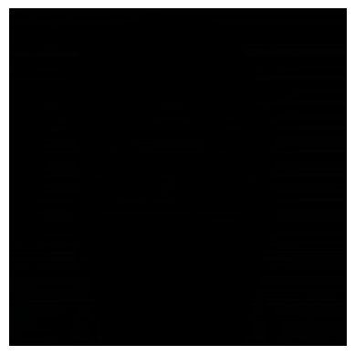

Vision Transformer Model + Configuration and Metrics 
----------------------------

The ViT Model is based on the architecture of the Transformer introduced by Vaswani et al. in the article *Attention Is All You Need*. While the original transformer is commonly used for NLP tasks, the ViT Model was implemented to work on images like is done with Convolution Neural Networks. The Transformer originally take a sequence of vector converted to embedding vector of fix features' size before being added to a 1 dimensional positional vector which learned to identify the position of each element in the sequence. In the ViT Model the sequence is composed of the patches that we define in the following notebook [preprocessing_and_loading](../preprocessing_and_loading.md). Each patch must be flattened in order that we obtain a input sequence of size $(N\times (D^2.C))$, where $N$ is the number of patches, D is the size of the height and width of the patches and $C$ is the number of channels. 

To make transfer learning with the pre-trained model the classification layer composed of two linear layers and a GeLU activation will take as entry the output of the encoder reshaped to $(batch\_size, Sequence\_size \times Model size)$ to give us a final output of $(batch\_size, number\_of\_labels)$. Only the weights of the classifier are randomly initialized in order to be trained on new images. 

Let us the architecture and define what make it different from the original Transformer architecture.


```python
# importing some libraries
from fake_face_detection.data.fake_face_dataset import FakeFaceDetectionDataset
from transformers import ViTForImageClassification
from transformers import ViTFeatureExtractor
from torch.utils.data import DataLoader
from torch.nn import functional as F
from torchvision import transforms
import matplotlib.pyplot as plt
import pytorch_lightning as pl
from PIL import Image
import numpy as np
import evaluate
import pickle
import torch

# set a seed for all the following process
pl.seed_everything(0)

```

    c:\Users\Oumar Kane\AppData\Local\pypoetry\Cache\virtualenvs\pytorch1-HleOW5am-py3.10\lib\site-packages\tqdm\auto.py:22: TqdmWarning: IProgress not found. Please update jupyter and ipywidgets. See https://ipywidgets.readthedocs.io/en/stable/user_install.html
      from .autonotebook import tqdm as notebook_tqdm
    Global seed set to 0
    


    0


### Architecture

The path or name of the ViT Model must be indicated in order to be load. We want to recuperate the base model pre-trained by Google on the ImageNet21k's images of size $(224\times 224)$ and requiring $16$ patches. That is, we need to indicate the following name: `google/vit-base-patch16-224-in21k`. We will also indicate the number of labels which is `2` in our case and we need to provide the class ids that we recuperated in [generate_an_visualize](../generate_and_visualize.md). 


```python
model_name = 'google/vit-base-patch16-224-in21k'

# recuperate the images characteristics
with open('data/extractions/fake_real_dict.txt', 'rb') as f:
    
    depick = pickle.Unpickler(f)
    
    characs = depick.load()

# recuperate the model and print the configurations
vit_model = ViTForImageClassification.from_pretrained(
    model_name,
    num_labels = 2,
    id2label = {name: key for key, name in characs['ids'].items()},
    label2id = characs['ids']
)

```

    Some weights of the model checkpoint at google/vit-base-patch16-224-in21k were not used when initializing ViTForImageClassification: ['pooler.dense.weight', 'pooler.dense.bias']
    - This IS expected if you are initializing ViTForImageClassification from the checkpoint of a model trained on another task or with another architecture (e.g. initializing a BertForSequenceClassification model from a BertForPreTraining model).
    - This IS NOT expected if you are initializing ViTForImageClassification from the checkpoint of a model that you expect to be exactly identical (initializing a BertForSequenceClassification model from a BertForSequenceClassification model).
    Some weights of ViTForImageClassification were not initialized from the model checkpoint at google/vit-base-patch16-224-in21k and are newly initialized: ['classifier.bias', 'classifier.weight']
    You should probably TRAIN this model on a down-stream task to be able to use it for predictions and inference.
    

We loaded above the main configurations of the ViT Model understanding:

- A `hidden size` or more commonly `d_model` of <i style = "color: orange">768</i> 

- A `number of features` of the `Feed Forward Network` of <i style = "color: orange">3072</i>

- A `number of encoder and decoder layers` of <i style = "color: orange">12</i>

- No drop out are used and a convolution layer of <i style = "color: orange">3</i> input channels is used to directly provide the projection of the patches.

This version of the ViT Model use the convolution layer to recuperate the projected version of the patches. We don't need anymore to split the images to patches and make a linear transformation on each of them. The size of the convolution layer's output can be found as follows:

$Out\_Height = Out\_Width = \frac{(224 - 16)}{16} + 1 = 14$

And the number of channels of the convolution layer is equal to the `hidden size`. Then the number of channels of the images pass from $3 \rightarrow 768$. Including the number of channels, we obtain a final output size of $(14, 14, 768)$ for the embedding matrix. The embedding matrix is transformed then to a vector of dimension $(14 \times 14, 768)$ in order to added to a position embedding of same dimension and fed into the ViT Model.

The id map that provided earlier will be used to make prediction on the test set.

The main differences between the original Transformer and the current Transformer is that the later on use a convolution layer to obtain the projections, only a encoder stacks is required, a pre-layer normalization is used in place of a post-layer normalization, a final `Multi Layer Perceptron` (MLP) is added in order to classify the images from the outputs or state of the encoder and each feed forward network use as activation function the `GeLU` in place of the `ReLU` activation. The `GeLU` activation can be approximate by

$$
GeLU(x) = 0.5x(1 + tanh[\sqrt{2\pi}(x + 0.044715x^3)])
$$

where $x$ is the input to the $GeLU$ activation. It provides a smoother function that the `ReLU`.

Let us display the whole architecture bellow.


```python
vit_model
```


    ViTForImageClassification(
      (vit): ViTModel(
        (embeddings): ViTEmbeddings(
          (patch_embeddings): ViTPatchEmbeddings(
            (projection): Conv2d(3, 768, kernel_size=(16, 16), stride=(16, 16))
          )
          (dropout): Dropout(p=0.0, inplace=False)
        )
        (encoder): ViTEncoder(
          (layer): ModuleList(
            (0): ViTLayer(
              (attention): ViTAttention(
                (attention): ViTSelfAttention(
                  (query): Linear(in_features=768, out_features=768, bias=True)
                  (key): Linear(in_features=768, out_features=768, bias=True)
                  (value): Linear(in_features=768, out_features=768, bias=True)
                  (dropout): Dropout(p=0.0, inplace=False)
                )
                (output): ViTSelfOutput(
                  (dense): Linear(in_features=768, out_features=768, bias=True)
                  (dropout): Dropout(p=0.0, inplace=False)
                )
              )
              (intermediate): ViTIntermediate(
                (dense): Linear(in_features=768, out_features=3072, bias=True)
                (intermediate_act_fn): GELUActivation()
              )
              (output): ViTOutput(
                (dense): Linear(in_features=3072, out_features=768, bias=True)
                (dropout): Dropout(p=0.0, inplace=False)
              )
              (layernorm_before): LayerNorm((768,), eps=1e-12, elementwise_affine=True)
              (layernorm_after): LayerNorm((768,), eps=1e-12, elementwise_affine=True)
            )
            (1): ViTLayer(
              (attention): ViTAttention(
                (attention): ViTSelfAttention(
                  (query): Linear(in_features=768, out_features=768, bias=True)
                  (key): Linear(in_features=768, out_features=768, bias=True)
                  (value): Linear(in_features=768, out_features=768, bias=True)
                  (dropout): Dropout(p=0.0, inplace=False)
                )
                (output): ViTSelfOutput(
                  (dense): Linear(in_features=768, out_features=768, bias=True)
                  (dropout): Dropout(p=0.0, inplace=False)
                )
              )
              (intermediate): ViTIntermediate(
                (dense): Linear(in_features=768, out_features=3072, bias=True)
                (intermediate_act_fn): GELUActivation()
              )
              (output): ViTOutput(
                (dense): Linear(in_features=3072, out_features=768, bias=True)
                (dropout): Dropout(p=0.0, inplace=False)
              )
              (layernorm_before): LayerNorm((768,), eps=1e-12, elementwise_affine=True)
              (layernorm_after): LayerNorm((768,), eps=1e-12, elementwise_affine=True)
            )
            (2): ViTLayer(
              (attention): ViTAttention(
                (attention): ViTSelfAttention(
                  (query): Linear(in_features=768, out_features=768, bias=True)
                  (key): Linear(in_features=768, out_features=768, bias=True)
                  (value): Linear(in_features=768, out_features=768, bias=True)
                  (dropout): Dropout(p=0.0, inplace=False)
                )
                (output): ViTSelfOutput(
                  (dense): Linear(in_features=768, out_features=768, bias=True)
                  (dropout): Dropout(p=0.0, inplace=False)
                )
              )
              (intermediate): ViTIntermediate(
                (dense): Linear(in_features=768, out_features=3072, bias=True)
                (intermediate_act_fn): GELUActivation()
              )
              (output): ViTOutput(
                (dense): Linear(in_features=3072, out_features=768, bias=True)
                (dropout): Dropout(p=0.0, inplace=False)
              )
              (layernorm_before): LayerNorm((768,), eps=1e-12, elementwise_affine=True)
              (layernorm_after): LayerNorm((768,), eps=1e-12, elementwise_affine=True)
            )
            (3): ViTLayer(
              (attention): ViTAttention(
                (attention): ViTSelfAttention(
                  (query): Linear(in_features=768, out_features=768, bias=True)
                  (key): Linear(in_features=768, out_features=768, bias=True)
                  (value): Linear(in_features=768, out_features=768, bias=True)
                  (dropout): Dropout(p=0.0, inplace=False)
                )
                (output): ViTSelfOutput(
                  (dense): Linear(in_features=768, out_features=768, bias=True)
                  (dropout): Dropout(p=0.0, inplace=False)
                )
              )
              (intermediate): ViTIntermediate(
                (dense): Linear(in_features=768, out_features=3072, bias=True)
                (intermediate_act_fn): GELUActivation()
              )
              (output): ViTOutput(
                (dense): Linear(in_features=3072, out_features=768, bias=True)
                (dropout): Dropout(p=0.0, inplace=False)
              )
              (layernorm_before): LayerNorm((768,), eps=1e-12, elementwise_affine=True)
              (layernorm_after): LayerNorm((768,), eps=1e-12, elementwise_affine=True)
            )
            (4): ViTLayer(
              (attention): ViTAttention(
                (attention): ViTSelfAttention(
                  (query): Linear(in_features=768, out_features=768, bias=True)
                  (key): Linear(in_features=768, out_features=768, bias=True)
                  (value): Linear(in_features=768, out_features=768, bias=True)
                  (dropout): Dropout(p=0.0, inplace=False)
                )
                (output): ViTSelfOutput(
                  (dense): Linear(in_features=768, out_features=768, bias=True)
                  (dropout): Dropout(p=0.0, inplace=False)
                )
              )
              (intermediate): ViTIntermediate(
                (dense): Linear(in_features=768, out_features=3072, bias=True)
                (intermediate_act_fn): GELUActivation()
              )
              (output): ViTOutput(
                (dense): Linear(in_features=3072, out_features=768, bias=True)
                (dropout): Dropout(p=0.0, inplace=False)
              )
              (layernorm_before): LayerNorm((768,), eps=1e-12, elementwise_affine=True)
              (layernorm_after): LayerNorm((768,), eps=1e-12, elementwise_affine=True)
            )
            (5): ViTLayer(
              (attention): ViTAttention(
                (attention): ViTSelfAttention(
                  (query): Linear(in_features=768, out_features=768, bias=True)
                  (key): Linear(in_features=768, out_features=768, bias=True)
                  (value): Linear(in_features=768, out_features=768, bias=True)
                  (dropout): Dropout(p=0.0, inplace=False)
                )
                (output): ViTSelfOutput(
                  (dense): Linear(in_features=768, out_features=768, bias=True)
                  (dropout): Dropout(p=0.0, inplace=False)
                )
              )
              (intermediate): ViTIntermediate(
                (dense): Linear(in_features=768, out_features=3072, bias=True)
                (intermediate_act_fn): GELUActivation()
              )
              (output): ViTOutput(
                (dense): Linear(in_features=3072, out_features=768, bias=True)
                (dropout): Dropout(p=0.0, inplace=False)
              )
              (layernorm_before): LayerNorm((768,), eps=1e-12, elementwise_affine=True)
              (layernorm_after): LayerNorm((768,), eps=1e-12, elementwise_affine=True)
            )
            (6): ViTLayer(
              (attention): ViTAttention(
                (attention): ViTSelfAttention(
                  (query): Linear(in_features=768, out_features=768, bias=True)
                  (key): Linear(in_features=768, out_features=768, bias=True)
                  (value): Linear(in_features=768, out_features=768, bias=True)
                  (dropout): Dropout(p=0.0, inplace=False)
                )
                (output): ViTSelfOutput(
                  (dense): Linear(in_features=768, out_features=768, bias=True)
                  (dropout): Dropout(p=0.0, inplace=False)
                )
              )
              (intermediate): ViTIntermediate(
                (dense): Linear(in_features=768, out_features=3072, bias=True)
                (intermediate_act_fn): GELUActivation()
              )
              (output): ViTOutput(
                (dense): Linear(in_features=3072, out_features=768, bias=True)
                (dropout): Dropout(p=0.0, inplace=False)
              )
              (layernorm_before): LayerNorm((768,), eps=1e-12, elementwise_affine=True)
              (layernorm_after): LayerNorm((768,), eps=1e-12, elementwise_affine=True)
            )
            (7): ViTLayer(
              (attention): ViTAttention(
                (attention): ViTSelfAttention(
                  (query): Linear(in_features=768, out_features=768, bias=True)
                  (key): Linear(in_features=768, out_features=768, bias=True)
                  (value): Linear(in_features=768, out_features=768, bias=True)
                  (dropout): Dropout(p=0.0, inplace=False)
                )
                (output): ViTSelfOutput(
                  (dense): Linear(in_features=768, out_features=768, bias=True)
                  (dropout): Dropout(p=0.0, inplace=False)
                )
              )
              (intermediate): ViTIntermediate(
                (dense): Linear(in_features=768, out_features=3072, bias=True)
                (intermediate_act_fn): GELUActivation()
              )
              (output): ViTOutput(
                (dense): Linear(in_features=3072, out_features=768, bias=True)
                (dropout): Dropout(p=0.0, inplace=False)
              )
              (layernorm_before): LayerNorm((768,), eps=1e-12, elementwise_affine=True)
              (layernorm_after): LayerNorm((768,), eps=1e-12, elementwise_affine=True)
            )
            (8): ViTLayer(
              (attention): ViTAttention(
                (attention): ViTSelfAttention(
                  (query): Linear(in_features=768, out_features=768, bias=True)
                  (key): Linear(in_features=768, out_features=768, bias=True)
                  (value): Linear(in_features=768, out_features=768, bias=True)
                  (dropout): Dropout(p=0.0, inplace=False)
                )
                (output): ViTSelfOutput(
                  (dense): Linear(in_features=768, out_features=768, bias=True)
                  (dropout): Dropout(p=0.0, inplace=False)
                )
              )
              (intermediate): ViTIntermediate(
                (dense): Linear(in_features=768, out_features=3072, bias=True)
                (intermediate_act_fn): GELUActivation()
              )
              (output): ViTOutput(
                (dense): Linear(in_features=3072, out_features=768, bias=True)
                (dropout): Dropout(p=0.0, inplace=False)
              )
              (layernorm_before): LayerNorm((768,), eps=1e-12, elementwise_affine=True)
              (layernorm_after): LayerNorm((768,), eps=1e-12, elementwise_affine=True)
            )
            (9): ViTLayer(
              (attention): ViTAttention(
                (attention): ViTSelfAttention(
                  (query): Linear(in_features=768, out_features=768, bias=True)
                  (key): Linear(in_features=768, out_features=768, bias=True)
                  (value): Linear(in_features=768, out_features=768, bias=True)
                  (dropout): Dropout(p=0.0, inplace=False)
                )
                (output): ViTSelfOutput(
                  (dense): Linear(in_features=768, out_features=768, bias=True)
                  (dropout): Dropout(p=0.0, inplace=False)
                )
              )
              (intermediate): ViTIntermediate(
                (dense): Linear(in_features=768, out_features=3072, bias=True)
                (intermediate_act_fn): GELUActivation()
              )
              (output): ViTOutput(
                (dense): Linear(in_features=3072, out_features=768, bias=True)
                (dropout): Dropout(p=0.0, inplace=False)
              )
              (layernorm_before): LayerNorm((768,), eps=1e-12, elementwise_affine=True)
              (layernorm_after): LayerNorm((768,), eps=1e-12, elementwise_affine=True)
            )
            (10): ViTLayer(
              (attention): ViTAttention(
                (attention): ViTSelfAttention(
                  (query): Linear(in_features=768, out_features=768, bias=True)
                  (key): Linear(in_features=768, out_features=768, bias=True)
                  (value): Linear(in_features=768, out_features=768, bias=True)
                  (dropout): Dropout(p=0.0, inplace=False)
                )
                (output): ViTSelfOutput(
                  (dense): Linear(in_features=768, out_features=768, bias=True)
                  (dropout): Dropout(p=0.0, inplace=False)
                )
              )
              (intermediate): ViTIntermediate(
                (dense): Linear(in_features=768, out_features=3072, bias=True)
                (intermediate_act_fn): GELUActivation()
              )
              (output): ViTOutput(
                (dense): Linear(in_features=3072, out_features=768, bias=True)
                (dropout): Dropout(p=0.0, inplace=False)
              )
              (layernorm_before): LayerNorm((768,), eps=1e-12, elementwise_affine=True)
              (layernorm_after): LayerNorm((768,), eps=1e-12, elementwise_affine=True)
            )
            (11): ViTLayer(
              (attention): ViTAttention(
                (attention): ViTSelfAttention(
                  (query): Linear(in_features=768, out_features=768, bias=True)
                  (key): Linear(in_features=768, out_features=768, bias=True)
                  (value): Linear(in_features=768, out_features=768, bias=True)
                  (dropout): Dropout(p=0.0, inplace=False)
                )
                (output): ViTSelfOutput(
                  (dense): Linear(in_features=768, out_features=768, bias=True)
                  (dropout): Dropout(p=0.0, inplace=False)
                )
              )
              (intermediate): ViTIntermediate(
                (dense): Linear(in_features=768, out_features=3072, bias=True)
                (intermediate_act_fn): GELUActivation()
              )
              (output): ViTOutput(
                (dense): Linear(in_features=3072, out_features=768, bias=True)
                (dropout): Dropout(p=0.0, inplace=False)
              )
              (layernorm_before): LayerNorm((768,), eps=1e-12, elementwise_affine=True)
              (layernorm_after): LayerNorm((768,), eps=1e-12, elementwise_affine=True)
            )
          )
        )
        (layernorm): LayerNorm((768,), eps=1e-12, elementwise_affine=True)
      )
      (classifier): Linear(in_features=768, out_features=2, bias=True)
    )


### Attention

An attention matrix is provided by the Multi-head-attention of the last encoder layer and correspond to the attention that was computed on each pixel of the image. It corresponds to two main series of concatenations between sub-attentions calculated inside the Multi-Head Attentions. Inside each Multi-Head Attention we have Self-attention which take some linear transformations from the input sequence: the queries $q$, the values $v$ and the keys $k$. It then compute the correlation between the queries and the keys as follows:

$$
attention_1 = \frac{q \times k^T}{\sqrt{hidden\_size}}
$$

The correlation matrix of dimension $(s_1, s_2)$, where $s_1 = s_2 = s$ is the sequence length, is transformed into a matrix of probabilities defining the attention weight that each element in sequence gives to an element in the sequence. It is obtaining with the softmax function applied on the second dimension of the correlation matrix:

$$
attention_2 = \frac{\exp(-attention_1)}{\sum_{s_2} \exp(-attention_1)}
$$

The final attention which define the most important pixels in an image is calculated by multiplying the attention weights of an element to each of their corresponding element of the sequence, summing over the results of that multiplications and concatenating all the summations made (each summation provide a vector of dimension $(s, d_v)$ where $d_v = d_k = d_q$ is the dimension of the values and is equal to that of the keys and queries):

$$
attention_h = attention_2 \times v
$$

The $h$ index indicate that we calculate the attention of a $h^{th}$ head. The concatenation between all the attentions are fed to the rest of the encoder layer process. 

To visualize the attention we will recuperate the output attention after the softmax function ($attention_2$) of the last encoder layer of dimension $(batch\_size, num\_heads, s, s)$ and take the attention provide by the last element to each element in the sequence that we need to reshape to $(batch\_size, num\_heads, patch\_size \times patch\_size)$ (Notice that we didn't added the batch size in the attention dimensions to simplify the explanation). The attention is resize to match that of the original image and visualized with `matplotlib`. Notice that the first dimension is of size $num\_heads$, we must then take the average over that dimension to obtain a final attention matrix of dimension $(batch\_size, 1, image\_height, image\_width)$. It will be multiplied with the original image to get a more clear visualization. Let us make an example with a random image from the dataset.


```python
# take the first training image without shuffling
img = Image.open('data/real_and_fake_face/training_fake/easy_1_1110.jpg')

img
```


    

    


```python
# recuperate the feature extractor
feature_extractor = ViTFeatureExtractor(model_name)

# recuperate the dataset
dataset = FakeFaceDetectionDataset('data/real_and_fake_face/training_fake/', 
                                   'data/real_and_fake_face/training_real/',
                                   id_map=characs['ids'], transformer=feature_extractor,
                                   transformer_kwargs={'return_tensors': 'pt'})

# load a batch of one sequence
image = next(iter(DataLoader(dataset)))
```

    c:\Users\Oumar Kane\AppData\Local\pypoetry\Cache\virtualenvs\pytorch1-HleOW5am-py3.10\lib\site-packages\transformers\models\vit\feature_extraction_vit.py:28: FutureWarning: The class ViTFeatureExtractor is deprecated and will be removed in version 5 of Transformers. Please use ViTImageProcessor instead.
      warnings.warn(
    

Let us provide the pixel values and labels to the model and set output attentions to <i style = "color: orange">True</i> to recuperate the attentions.


```python
outputs = vit_model(image['pixel_values'][0], output_attentions = True, labels = image['labels'])
```

Let us recuperate the attention matrix of the last encoder layer, take that of the last patch and calculate the mean attention over the heads.


```python
# recuperate the attention of the last encoder layer attention heads
attention = outputs.attentions[-1].detach().cpu()

# recuperate the attention provided by the last patch (notice that we eliminate 1 because of the +1 added by the convolutation layer)
attention = attention[:, :, -1, 1:]

# calculate the mean attention
attention = attention.mean(axis = 1)

# let us recuperate the size of the original image and define patch size
pixel_values = image['pixel_values'][0]
img_size = pixel_values.shape
patch_size = 14

# let us reshape transform the image to a numpy array
img = np.array(transforms.Resize(224)(img))

# calculate the scale factor
scale_factor = img_size[3] * img_size[2] / (patch_size * patch_size)

# rescale the attention with the nearest scaler
attention = F.interpolate(attention.unsqueeze(0), scale_factor=scale_factor,
                          mode='nearest')

# let us reshape the attention to the right size
attention = attention.reshape(img_size[2], img_size[3], 1)

```

Let us multiply the obtained attention with the image and display the result.


```python
# recuperate the result
attention_image = img / 255 * attention.numpy()

# visualize the result
plt.imshow(attention_image)

plt.axis('off')

plt.show()
```


    

    


We obtain the above result because we didn't yet trained the model on the images. Let us create in the next section a function that makes us visualize the most important pixels in the test set's images.

### Metrics and predictions

Let us create a function that will compute the `accuracy`, the `f1-score` and the `auc` at each training iteration.


```python
%%writefile fake-face-detection/fake_face_detection/metrics/compute_metrics.py

import numpy as np
import evaluate

metrics = {
    'f1': evaluate.load('f1'),
    'accuracy': evaluate.load('accuracy'),
    'roc_auc': evaluate.load('roc_auc', 'multiclass')
}

def compute_metrics(p): # some part was got from https://huggingface.co/blog/fine-tune-vit
    
    predictions, label_ids = p
    
    metric = metrics['accuracy'].compute(predictions = np.argmax(predictions, axis = 1), references=label_ids)
    
    f1_score = metrics['f1'].compute(predictions=np.argmax(predictions, axis = 1), references=label_ids)
    
    metric.update(f1_score)
    
    try:
        
        auc = metrics['roc_auc'].compute(prediction_scores=predictions, references=label_ids)
    
        metric.update(auc)
        
    except:
        
        pass
        
    return metric
    
    
```

    Overwriting fake-face-detection/fake_face_detection/metrics/compute_metrics.py
    

The following function will help us obtain the predictions and the attentions will be visualized in tensorboard.


```python
%%writefile fake-face-detection/fake_face_detection/metrics/make_predictions.py

from fake_face_detection.data.fake_face_dataset import FakeFaceDetectionDataset
from fake_face_detection.metrics.compute_metrics import compute_metrics
from torch.utils.tensorboard import SummaryWriter
from PIL.JpegImagePlugin import JpegImageFile
from torch.utils.data import DataLoader
from torch.nn import functional as F
from torchvision import transforms
import matplotlib.pyplot as plt
from glob import glob
from PIL import Image
import pandas as pd
from math import *
import numpy as np
import torch
import os

def get_attention(image: str, attention: torch.Tensor, size: tuple, patch_size: tuple):
    
    # recuperate the image as a numpy array
    with Image.open(image) as img:
    
        img = np.array(transforms.Resize(size)(img))
        
    # recuperate the attention provided by the last patch (notice that we eliminate 1 because of the +1 added by the convolutation layer)
    attention = attention[:, -1, 1:]

    # calculate the mean attention
    attention = attention.mean(axis = 0)

    # let us reshape transform the image to a numpy array

    # calculate the scale factor
    scale_factor = size[0] * size[1] / (patch_size[0] * patch_size[1])

    # rescale the attention with the nearest scaler
    attention = F.interpolate(attention.reshape(1, 1, -1), scale_factor=scale_factor,
                            mode='nearest')

    # let us reshape the attention to the right size
    attention = attention.reshape(size[0], size[1], 1)
    
    # recuperate the result
    attention_image = img / 255 * attention.numpy()
    
    return attention_image


def make_predictions(test_dataset: FakeFaceDetectionDataset,
                     model,
                     log_dir: str = "fake_face_logs",
                     tag: str = "Attentions",
                     batch_size: int = 3,
                     size: tuple = (224, 224), 
                     patch_size: tuple = (14, 14),
                     figsize: tuple = (24, 24)):
    
    with torch.no_grad():
        
        _ = model.eval()
        
        # initialize the logger
        writer = SummaryWriter(os.path.join(log_dir, "attentions"))
        
        # let us recuperate the images and labels
        images = test_dataset.images
        
        labels = test_dataset.labels
        
        # let us initialize the predictions
        predictions = {'attentions': [], 'predictions': [], 'true_labels': labels, 'predicted_labels': []}

        # let us initialize the dataloader
        test_dataloader = DataLoader(test_dataset, batch_size=batch_size)
        
        # get the loss
        loss = 0
        
        for data in test_dataloader:
            
            # recuperate the pixel values
            pixel_values = data['pixel_values'][0].cuda()
            
            # recuperate the labels
            labels_ = data['labels'].cuda()
            
            # # recuperate the outputs
            outputs = model(pixel_values, labels = labels_, output_attentions = True)
            
            # recuperate the predictions
            predictions['predictions'].append(torch.softmax(outputs.logits.detach().cpu(), axis = -1).numpy())
            
            # recuperate the attentions of the last encoder layer
            predictions['attentions'].append(outputs.attentions[-1].detach().cpu())
            
            # add the loss
            loss += outputs.loss.detach().cpu().item()
        
        predictions['predictions'] = np.concatenate(predictions['predictions'], axis = 0)
        
        predictions['attentions'] = torch.concatenate(predictions['attentions'], axis = 0)
        
        predictions['predicted_labels'] = np.argmax(predictions['predictions'], axis = -1).tolist()
        
        # let us calculate the metrics
        metrics = compute_metrics((predictions['predictions'], np.array(predictions['true_labels'])))
        metrics['loss'] = loss / len(test_dataloader)
        
        # for each image we will visualize his attention
        nrows = ceil(sqrt(len(images)))
        
        fig, axes = plt.subplots(nrows=nrows, ncols=nrows, figsize = figsize)
        
        axes = axes.flat
        
        for i in range(len(images)):
            
            attention_image = get_attention(images[i], predictions['attentions'][i], size, patch_size)
        
            axes[i].imshow(attention_image)
            
            axes[i].set_title(f'Image {i + 1}')
            
            axes[i].axis('off')
            
        fig.tight_layout()
        
        [fig.delaxes(axes[i]) for i in range(len(images), nrows * nrows)]
        
        writer.add_figure(tag, fig)    
        
        # let us remove the predictions and the attentions
        del predictions['predictions']
        del predictions['attentions']
        
        # let us recuperate the metrics and the predictions
        return pd.DataFrame(predictions), metrics
        
        
        
```

    Overwriting fake-face-detection/fake_face_detection/metrics/make_predictions.py
    

Let us make predictions on the test dataset and print the metrics.


```python
%run fake-face-detection/fake_face_detection/metrics/make_predictions.py

# recuperate the test dataset 
test_dataset = FakeFaceDetectionDataset('data/real_and_fake_splits/test/training_fake/',
                                        'data/real_and_fake_splits/test/training_real/',
                                        characs['ids'],
                                        feature_extractor, transformer_kwargs={'return_tensors': 'pt'})

# recuperate the predictions
predictions, metrics = make_predictions(test_dataset, vit_model.cuda())
```


```python
predictions
```


<div>
<style scoped>
    .dataframe tbody tr th:only-of-type {
        vertical-align: middle;
    }

    .dataframe tbody tr th {
        vertical-align: top;
    }

    .dataframe thead th {
        text-align: right;
    }
</style>
<table border="1" class="dataframe">
  <thead>
    <tr style="text-align: right;">
      <th></th>
      <th>true_labels</th>
      <th>predicted_labels</th>
    </tr>
  </thead>
  <tbody>
    <tr>
      <th>0</th>
      <td>0</td>
      <td>1</td>
    </tr>
    <tr>
      <th>1</th>
      <td>0</td>
      <td>1</td>
    </tr>
    <tr>
      <th>2</th>
      <td>0</td>
      <td>0</td>
    </tr>
    <tr>
      <th>3</th>
      <td>0</td>
      <td>1</td>
    </tr>
    <tr>
      <th>4</th>
      <td>0</td>
      <td>0</td>
    </tr>
    <tr>
      <th>...</th>
      <td>...</td>
      <td>...</td>
    </tr>
    <tr>
      <th>200</th>
      <td>1</td>
      <td>0</td>
    </tr>
    <tr>
      <th>201</th>
      <td>1</td>
      <td>1</td>
    </tr>
    <tr>
      <th>202</th>
      <td>1</td>
      <td>1</td>
    </tr>
    <tr>
      <th>203</th>
      <td>1</td>
      <td>1</td>
    </tr>
    <tr>
      <th>204</th>
      <td>1</td>
      <td>1</td>
    </tr>
  </tbody>
</table>
<p>205 rows × 2 columns</p>
</div>


```python
metrics
```


    {'accuracy': 0.5707317073170731,
     'f1': 0.66412213740458,
     'loss': 0.6821330612984257}


